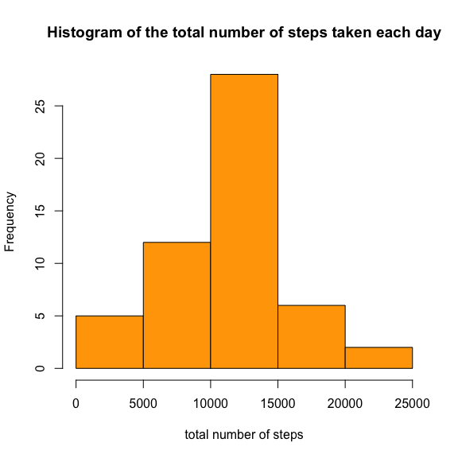
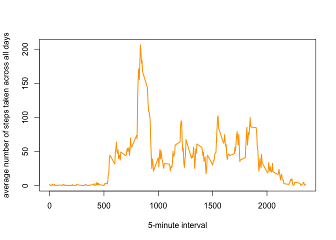
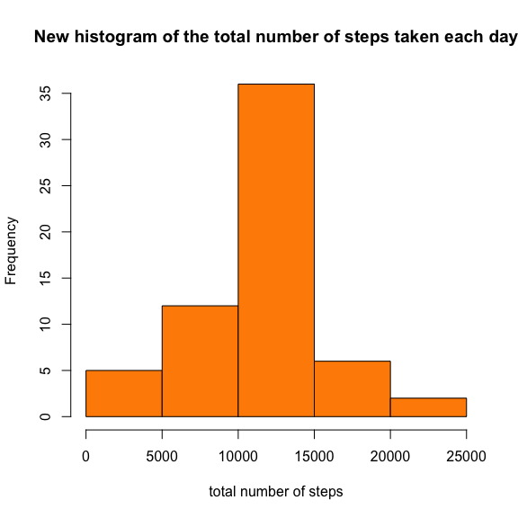
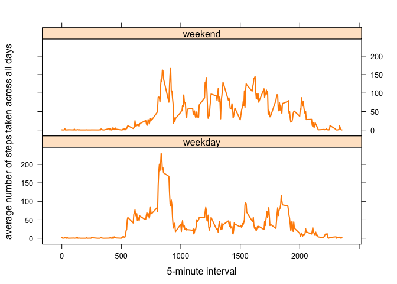

<style>
div.blue pre { background-color:lightgrey; }
div.blue pre.r { background-color:#B2EF54; }
</style>

### Loading and preprocessing the data
Load and look at the data.

<div class = "blue">

```r
old <- read.csv("~/Downloads/activity.csv")
head(old)
```

```
##   steps       date interval
## 1    NA 2012-10-01        0
## 2    NA 2012-10-01        5
## 3    NA 2012-10-01       10
## 4    NA 2012-10-01       15
## 5    NA 2012-10-01       20
## 6    NA 2012-10-01       25
```

```r
summary(old)
```

```
##      steps                date          interval     
##  Min.   :  0.00   2012-10-01:  288   Min.   :   0.0  
##  1st Qu.:  0.00   2012-10-02:  288   1st Qu.: 588.8  
##  Median :  0.00   2012-10-03:  288   Median :1177.5  
##  Mean   : 37.38   2012-10-04:  288   Mean   :1177.5  
##  3rd Qu.: 12.00   2012-10-05:  288   3rd Qu.:1766.2  
##  Max.   :806.00   2012-10-06:  288   Max.   :2355.0  
##  NA's   :2304     (Other)   :15840
```
</div>

It is clear that there are a lot of missing values in the data, which needs to be dealt with later.

### Question 1 What is mean total number of steps taken per day?

For this part of the assignment, I will ignore the missing values in the dataset as instructed. 

Calculate the total number of steps taken per day using dplyr.

<div class = "blue">

```r
library(dplyr)
summary_old1 <- old %>% group_by(date) %>% summarise(total = sum(steps))
head(summary_old1)
```

```
## # A tibble: 6 x 2
##   date       total
##   <fct>      <int>
## 1 2012-10-01    NA
## 2 2012-10-02   126
## 3 2012-10-03 11352
## 4 2012-10-04 12116
## 5 2012-10-05 13294
## 6 2012-10-06 15420
```
</div>

Make a histogram of the total number of steps taken each day.

<div class = "blue">

```r
hist(summary_old1$total, main = "Histogram of the total number of steps taken each day", xlab = "total number of steps", col = "orange")
```

<!-- -->
</div>

Calculate and report the mean and median of the total number of steps taken per day.

<div class = "blue">

```r
summary(summary_old1$total)
```

```
##    Min. 1st Qu.  Median    Mean 3rd Qu.    Max.    NA's 
##      41    8841   10765   10766   13294   21194       8
```
</div>

**The mean and median of the total number of steps taken per day are 10766 and 10765 respectively.**

### Question 2 What is the average daily activity pattern?

Make a time series plot (type = "l") of the 5-minute interval (x-axis) and the average number of steps taken, averaged across all days (y-axis).

<div class = "blue">

```r
summary_old2 <- old %>% group_by(interval) %>% summarise(average = mean(steps, na.rm = TRUE))
head(summary_old2)
```

```
## # A tibble: 6 x 2
##   interval average
##      <int>   <dbl>
## 1        0  1.72  
## 2        5  0.340 
## 3       10  0.132 
## 4       15  0.151 
## 5       20  0.0755
## 6       25  2.09
```

```r
summary(summary_old2)
```

```
##     interval         average       
##  Min.   :   0.0   Min.   :  0.000  
##  1st Qu.: 588.8   1st Qu.:  2.486  
##  Median :1177.5   Median : 34.113  
##  Mean   :1177.5   Mean   : 37.383  
##  3rd Qu.:1766.2   3rd Qu.: 52.835  
##  Max.   :2355.0   Max.   :206.170
```

```r
with(summary_old2, plot(x = interval, y = average, type = "l", lwd = 2, col = "orange", xlab = "5-minute interval", ylab = "average number of steps taken across all days"))
```

<!-- -->
</div>

### Imputing missing values

Note that there are a number of days/intervals where there are missing values, NAs. The presence of missing days may introduce bias into some calculations or summaries of the data. 

Calculate and report the total number of missing values in the dataset (i.e. the total number of rows with NAs.)

<div class = "blue">

```r
no_missing_row <- nrow(old[!complete.cases(old), ])
no_missing_row
```

```
## [1] 2304
```
</div>

**The total number of rows with NAs is 2304.**

Devise a strategy for filling in all of the missing values in the dataset. The strategy does not need to be sophisticated. For example, you could use the mean/median for that day or the mean for that 5-minute interval, etc. 

I decided to use the mean for that 5-minute interval (data from summary_old2). Firstly, I split the data into two data frames, 'complete' and 'missing'. Then I replaced the NAs in 'missing' with the mean for 5-minute interval. Then I combined the altered 'missing' data frame and 'complete' data frame to create a new dataset 'new' with the missing data filled in.

<div class = "blue">

```r
complete <- old[complete.cases(old), ]
missing <- old[!complete.cases(old), ]
missing$steps[missing$interval %in% summary_old2$interval] <- summary_old2$average
new <- rbind(complete, missing)
```
</div>

Make a histogram of the total number of steps taken each day and calculate and report the mean and median total number of steps taken per day. 

<div class = "blue">

```r
summary_new <- new %>% group_by(date) %>% summarise(total = sum(steps))
head(summary_new)
```

```
## # A tibble: 6 x 2
##   date        total
##   <fct>       <dbl>
## 1 2012-10-01 10766.
## 2 2012-10-02   126 
## 3 2012-10-03 11352 
## 4 2012-10-04 12116 
## 5 2012-10-05 13294 
## 6 2012-10-06 15420
```

```r
hist(summary_new$total, main = "New histogram of the total number of steps taken each day", xlab = "total number of steps", col = "darkorange")
```

<!-- -->
</div>

Calculate and report the mean and median of the total number of steps taken per day.

<div class = "blue">

```r
summary(summary_new$total)
```

```
##    Min. 1st Qu.  Median    Mean 3rd Qu.    Max. 
##      41    9819   10766   10766   12811   21194
```
</div>

**The mean and median of the total number of steps taken per day are 10766 and 10766 respectively.**

### Question 3 Are there differences in activity patterns between weekdays and weekends?

For this part the weekdays() function is used. The dataset with the filled-in missing values, 'new', is used.

Create a new factor variable in the dataset with two levels - "weekday" and "weekend" indicating whether a given date is a weekday or weekend day.

<div class = "blue">

```r
new_week <- new %>% mutate(day = weekdays(as.Date(date))) %>% mutate (day = case_when(day %in% c("Monday", "Tuesday", "Wednesday", "Thursday", "Friday") ~ "weekday", day %in% c("Saturday", "Sunday") ~ "weekend"))
head(new_week)
```

```
##   steps       date interval     day
## 1     0 2012-10-02        0 weekday
## 2     0 2012-10-02        5 weekday
## 3     0 2012-10-02       10 weekday
## 4     0 2012-10-02       15 weekday
## 5     0 2012-10-02       20 weekday
## 6     0 2012-10-02       25 weekday
```
</div>

Make a panel plot containing a time series plot (i.e. type = "l") of the 5-minute interval (x-axis) and the average number of steps taken, averaged across all weekday days or weekend days (y-axis).

<div class = "blue">

```r
summary_new_week <- new_week %>% group_by(interval, day) %>% summarise(average = mean(steps, na.rm = TRUE))
head(summary_new_week)
```

```
## # A tibble: 6 x 3
## # Groups:   interval [3]
##   interval day     average
##      <int> <chr>     <dbl>
## 1        0 weekday  2.25  
## 2        0 weekend  0.215 
## 3        5 weekday  0.445 
## 4        5 weekend  0.0425
## 5       10 weekday  0.173 
## 6       10 weekend  0.0165
```

```r
summary(summary_new_week)
```

```
##     interval          day               average       
##  Min.   :   0.0   Length:576         Min.   :  0.000  
##  1st Qu.: 588.8   Class :character   1st Qu.:  2.047  
##  Median :1177.5   Mode  :character   Median : 28.133  
##  Mean   :1177.5                      Mean   : 38.988  
##  3rd Qu.:1766.2                      3rd Qu.: 61.263  
##  Max.   :2355.0                      Max.   :230.378
```

```r
library(lattice)
with(summary_new_week, xyplot(average ~ interval|day, type = "l", lwd = 2, col = "darkorange", xlab = "5-minute interval", ylab = "average number of steps taken across all days", layout= c(1, 2)))
```

<!-- -->
</div>
